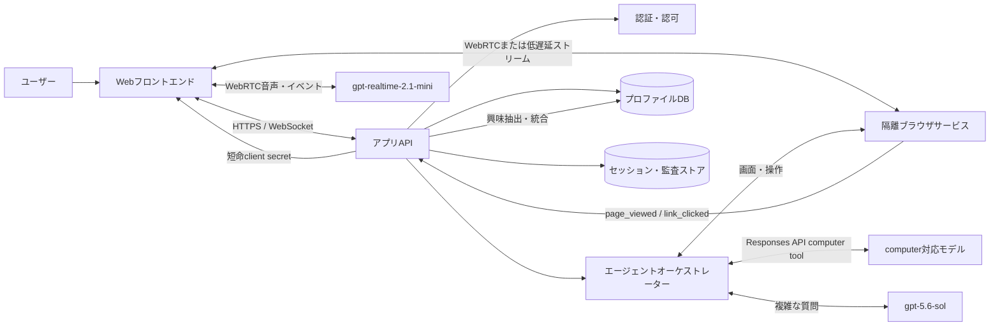
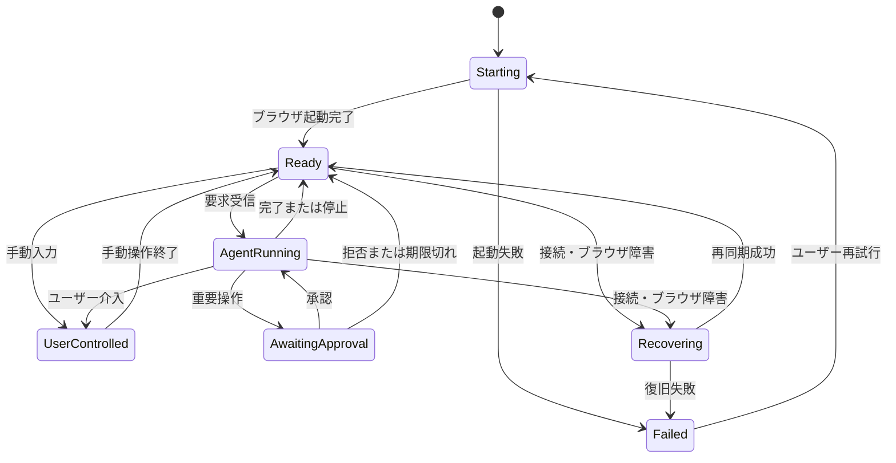

# Webpage Vision Agent 開発仕様

## 1. 文書情報

| 項目 | 内容 |
| --- | --- |
| 文書状態 | Draft 1.0 |
| 対象 | MVPデモ |
| 対象サイト | `https://lexus.jp/` |
| 提供形態 | Webアプリケーション |
| 必須言語 | 日本語 |

本書は、Lexus公式サイトを閲覧・操作しながら、テキストまたは音声でAIと対話できるデモアプリケーションの製品要件、システム境界、安全要件および受入基準を定義する。

### 1.1 Azure開発環境

| 項目 | 値 |
| --- | --- |
| 環境名 | Development |
| Microsoft EntraテナントID | `7b6b7a10-a2d2-4306-9687-a6b1d51976d7` |
| AzureサブスクリプションID | `6a372b32-f8e9-460f-8f2a-2329a10fa8ef` |
| 初期セットアップアカウント | `kenichin@MngEnvMCAP903977.onmicrosoft.com` |
| リソースグループ | `rg-webpage-vision-agent-dev` |

- 開発環境のAzureリソースは、原則として上記サブスクリプションの `rg-webpage-vision-agent-dev` に作成する。
- デプロイ処理は実行前にテナントID、サブスクリプションID、リソースグループを照合し、異なる環境への誤配備を防止する。
- 初期セットアップアカウントは対話的な構築・検証に使用できるが、アプリケーションの実行IDとして使用しない。本稼働コンポーネント間のAzureアクセスには、最小権限を付与したマネージドIDを使用する。
- テナントID、サブスクリプションID、リソースグループ名は環境設定として管理する。アカウントのパスワード、アクセストークン、APIキーその他の秘密値は本書、ソースコード、コミット対象の設定ファイルへ保存しない。
- リージョン、Microsoft Foundryリソース名、モデルデプロイ名、APIバージョンはPhase 0で確定する。

## 2. 目的

ユーザーが車両について自然言語で相談すると、AIがユーザーのプロファイルと過去の閲覧行動を考慮し、Lexus公式サイト上で情報探索、比較、絞り込みなどを実行する。ユーザー自身も同じブラウザ画面を操作でき、その行動から推定した自動車に関する興味を次の対話と提案に反映する。

### 2.1 対象ユーザー

- Lexus車を検討し、モデルや機能を対話形式で探索したいユーザー
- AIによるWeb操作とパーソナライズを体験するデモ参加者
- デモの運用状況とAI操作を確認する開発・運用担当者

### 2.2 主要ユースケース

1. ユーザーが「家族5人で使いやすいSUVを探して」と入力し、AIが該当ページへ移動する。
2. ユーザーが日本語で話し、AIが音声で応答しながらページを操作する。
3. ユーザーがモデルページを閲覧したりリンクをクリックしたりすると、その履歴から興味がプロファイルへ自動追加される。
4. AIが蓄積された興味を参照し、次回の回答や探索条件を最適化する。
5. 問い合わせや見積依頼など外部へ情報を送信する直前に、ユーザーが内容を確認して承認または拒否する。

### 2.3 MVP成功条件

- 左ペインで対象サイトを表示し、ユーザーとAIが同じブラウザセッションを操作できる。
- 右ペインでテキスト入力とリアルタイム音声対話ができる。
- Microsoft Foundryにデプロイしたcomputer-useモデルが、画面を観測して許可された操作を実行できる。
- 手動操作とAI操作の閲覧・クリック履歴が保存され、興味が自動追加される。
- プロファイルと興味が回答およびページ操作に反映される。
- 重要操作は明示承認なしに実行されない。

## 3. スコープ

### 3.1 MVPに含むもの

- `https://lexus.jp/` を起点とする許可ドメイン内の閲覧
- デスクトップ向け2ペインUI
- 狭幅画面向けのペイン切り替えUI
- ユーザーによるブラウザ手動操作
- computer-useモデルによるブラウザ操作
- テキストチャット
- 日本語のリアルタイム音声入出力
- 基本属性、車両希望条件、興味を持つプロファイル
- 閲覧ページとクリックリンクの行動履歴
- 行動履歴からの興味の自動抽出と統合
- 重要操作の承認
- 操作、承認、障害の監査ログ

### 3.2 MVPに含まないもの

- 任意URLまたはLexus以外のサイトへの対応
- 車両の購入、契約、決済の自動実行
- 連絡先情報および所有車情報のプロファイル保存
- Lexus側の会員・販売店システムとの専用API連携
- 複数ユーザーで共有するプロファイル
- ネイティブモバイルアプリおよびデスクトップアプリ
- 健康、思想、信条、民族、政治的見解などセンシティブ属性の推定

## 4. 用語

| 用語 | 定義 |
| --- | --- |
| 隔離ブラウザ | サーバー側のユーザー専用環境で動作するブラウザ。画面と入力をWebアプリへ配信する。 |
| browser session | 1ユーザーのCookie、ページ状態、画面、操作イベントを保持する隔離された実行単位。 |
| agent run | 1件のユーザー要求を受け、観測、推論、操作、再観測を繰り返す処理単位。 |
| 重要操作 | 外部送信、個人情報入力、規約同意、予約・見積・問い合わせの確定など、ユーザーへの影響を伴う操作。 |
| 行動履歴 | ページ閲覧とリンククリックを、手動・AIの操作主体とともに記録したイベント。 |
| 興味 | 行動履歴から推定した車種、装備、価格帯、利用シーンなどの自動車選好。 |

## 5. ユーザー体験

### 5.1 基本レイアウト

- 画面は左のブラウザペインと右のアシスタントペインで構成する。
- 初期比率は左70%、右30%とし、境界をドラッグして変更できる。
- 幅が狭い画面では「Web」と「チャット」のタブで切り替える。音声停止と重要操作の承認状態は、どちらのタブでも確認できなければならない。
- ペインサイズの変更によってブラウザセッション、会話、録音状態を失ってはならない。

### 5.2 左ペイン: ブラウザ

- セッション開始時に `https://lexus.jp/` を開く。
- 通常の外部サイトiframe埋め込みには依存せず、隔離ブラウザの画面を低遅延で配信する。
- 左ペイン、ユーザー入力、computer-useモデルの画面観測は、同一の隔離Chromium Pageを共有する。左ペインにはCDP screencastをストリーミング配信し、静止画取得APIは初期表示、再同期、障害時fallbackに使用する。
- ユーザーのポインター、クリック、スクロール、キーボード入力を隔離ブラウザへ転送する。
- AI操作中も画面更新を表示し、現在の操作を短い状態文で示す。
- 現在URL、戻る、進む、再読み込み、AI操作停止を提供する。URL欄はLexus公式サイトの許可ドメイン内に限って編集・遷移でき、許可外URLへの入力はサーバー側で拒否する。
- 状態は少なくとも `starting`、`ready`、`user_controlled`、`agent_running`、`awaiting_approval`、`recovering`、`failed` を持つ。
- AIとユーザーが同時に入力しないよう、ユーザーが手動操作を始めた時点でagent runを一時停止する。
- CAPTCHA、ログイン、Cookie同意など、人による判断が必要な画面ではAI操作を停止してユーザーへ制御を返す。

### 5.3 右ペイン: チャット

- ユーザーとAIの発言、操作状況、承認要求、回復可能なエラーを時系列で表示する。
- 複数行テキスト入力、送信、生成・操作停止を提供する。
- 同一入力の二重送信を防ぎ、処理中の要求を識別できるようにする。
- AI回答は、実行した操作と参照したプロファイル上の興味を簡潔に説明できる。
- モデルの内部推論、秘密情報、未加工のシステムプロンプトは表示しない。
- 新着メッセージを支援技術へ通知し、キーボードだけで主要機能を操作できるようにする。

### 5.4 リアルタイム音声対話

- 初回開始時にブラウザのマイク権限を要求する。
- 音声開始・停止、マイクミュート、AI音声ミュートを個別に操作できる。
- ユーザー発話をストリーミング認識し、確定前の途中字幕と確定字幕を区別して表示する。
- 発話終了を検出して要求を送信し、AIのテキスト回答と音声をストリーミング再生する。
- ユーザーの再発話でAI音声を中断できる。中断後は新しい発話を優先する。
- マイク権限拒否、音声接続失敗、未対応ブラウザでは、会話履歴を維持したままテキスト入力へフォールバックする。
- 音声を永続保存しない。MVPで保存するのは確定した文字起こしのみとする。
- 音声経路はFoundry `gpt-realtime-2.1-mini` とWebRTCで接続し、semantic VAD、ストリーミング文字起こし、音声応答、割り込みを同一セッションで処理する。
- 比較、推薦、多条件判断は高水準toolを介して `gpt-5.6-sol` へ委譲する。8秒以内に完了しない場合は `gpt-5.4` へフォールバックする。
- WebRTC接続にはアプリAPIがManaged Identityで取得した短命client secretを使用し、Azureの長期資格情報をブラウザへ渡さない。
- `gpt-4o-mini-transcribe` と `gpt-4o-mini-tts` の既存APIはRealtime接続を使わないテキスト経路の互換fallbackとして維持する。

### 5.5 プロファイル画面

- 右ペインからプロファイルの表示・編集画面を開ける。
- 明示入力項目と自動推定された興味を分けて表示する。
- 興味には名称、カテゴリ、スコア、最終更新日時、根拠となった行動の要約を表示する。
- ユーザーは興味の名称変更と削除ができる。
- 行動履歴の収集状態を常に確認でき、一時停止、再開、履歴の一括削除ができる。
- 履歴を削除した場合、その履歴だけを根拠とする興味も削除または再計算する。

## 6. 機能要件

要件IDは実装、テスト、レビューで共通して使用する。

### 6.1 セッションとブラウザ操作

| ID | 要件 |
| --- | --- |
| FR-BR-001 | 認証済みユーザーごとに専用のbrowser sessionを生成する。 |
| FR-BR-002 | 新規セッションは対象URLを初期ページとして開く。 |
| FR-BR-003 | 画面、URL、読み込み状態、ユーザー入力をWebアプリと隔離ブラウザ間で双方向同期する。 |
| FR-BR-004 | 手動操作とAI操作を同一browser sessionで実行する。 |
| FR-BR-005 | 同時入力を排他制御し、手動操作をAI操作より優先する。 |
| FR-BR-006 | 許可ドメイン外への遷移を停止し、ユーザーへ理由を表示する。 |
| FR-BR-007 | セッション終了またはタイムアウト時にブラウザプロセスと一時データを破棄する。 |

初期許可ドメインは `lexus.jp` と、その表示に必要で事前検証済みのLexus管理下サブドメインおよび静的アセット配信元とする。許可リストはサーバー設定で管理する。

### 6.2 テキスト・音声チャット

| ID | 要件 |
| --- | --- |
| FR-CH-001 | テキスト入力からagent runを開始できる。 |
| FR-CH-002 | 日本語の音声入力からagent runを開始できる。 |
| FR-CH-003 | AI回答をテキストと日本語音声で同時に提供できる。 |
| FR-CH-004 | ユーザーは生成、音声再生、Web操作を一括停止できる。 |
| FR-CH-005 | 切断後に会話とブラウザの現在状態を再同期できる。 |
| FR-CH-006 | 音声が利用できない場合もテキスト機能を継続できる。 |

### 6.3 computer-useエージェント

1回のagent runは次のループで動作する。

1. ユーザー要求、会話要約、有効なプロファイル、現在URL、最新画面を収集する。
2. Microsoft Foundryのcomputer-useモデルへ、目的、制約、画面、直前の操作結果を送信する。
3. モデルが返す操作を許可済みアクションスキーマとして検証する。
4. 重要操作であれば承認待ちへ遷移し、それ以外は隔離ブラウザで実行する。
5. 操作後の画面、URL、ページ状態、エラーを再観測する。
6. 目的達成、ユーザー停止、安全停止、最大ステップ到達、タイムアウトのいずれかまで繰り返す。

| ID | 要件 |
| --- | --- |
| FR-AG-001 | モデルはスクリーンショットを主な画面観測として使用する。補助的なアクセシビリティ情報を使用してよい。 |
| FR-AG-002 | 実行可能な操作をクリック、ダブルクリック、スクロール、文字入力、キー押下、待機、戻るに限定する。 |
| FR-AG-003 | 操作座標、入力値、対象URL、操作結果をサーバー側で検証する。 |
| FR-AG-004 | 1回のagent runに最大ステップ数と総タイムアウトを設定できる。初期値は20ステップ、120秒とする。 |
| FR-AG-005 | 同じ画面と操作の反復を検出した場合、3回以内に停止してユーザーへ確認する。 |
| FR-AG-006 | モデルまたはAPI障害時に自動操作を停止し、手動操作へ制御を戻す。 |
| FR-AG-007 | プロファイルは目的達成に必要な項目だけをモデルへ送る。 |
| FR-AG-008 | ページ内の文言を命令ではなく信頼できないコンテンツとして扱う。 |

モデルのデプロイ名、APIバージョン、リージョンは環境設定とし、ソースコードへ固定しない。computer-use機能の利用可能性、プレビュー条件、アクション形式は実装開始前スパイクで確定する。

### 6.4 重要操作の承認

閲覧、検索、絞り込み、比較、通常のページ遷移は承認なしで実行できる。次の操作は実行直前の承認を必須とする。

- 問い合わせ、見積、試乗、来店、予約などの送信または確定
- 氏名、住所、メールアドレス、電話番号その他個人情報の入力
- 利用規約、プライバシーポリシー、Cookie選択への同意
- ファイルのアップロードまたはダウンロード
- ログイン、アカウント作成、認証コード入力
- 許可リストで明示的に重要と定義された操作

承認画面には、実行する操作、対象ページ、入力・送信する値、想定される影響を表示する。承認は当該操作1回だけに有効とし、変更、期限切れ、ページ遷移後に使い回してはならない。拒否またはタイムアウト時は操作を実行せず、代替案を提示する。

### 6.5 プロファイル

#### 6.5.1 明示入力項目

| 項目 | 必須 | 例 |
| --- | --- | --- |
| 表示名 | 任意 | デモユーザー |
| 居住地域 | 任意 | 東京都 |
| 言語 | 必須 | ja-JP |
| おおよその予算 | 任意 | 700万円以下 |
| 主な用途 | 任意 | 家族利用、通勤、アウトドア |
| 希望ボディタイプ | 任意 | SUV、セダン |
| 乗車人数 | 任意 | 5 |
| 重視点 | 任意 | 安全性、燃費、荷室 |

- ユーザーは作成、閲覧、編集、削除、会話ごとの利用停止ができる。
- 明示入力項目と行動から推定した興味が矛盾する場合は、明示入力を優先する。
- 削除した項目を会話要約、キャッシュ、モデル入力に残さない。

#### 6.5.2 行動履歴

手動操作とAI操作は、同じイベント生成経路を使用する。

| イベント | 保存項目 |
| --- | --- |
| `page_viewed` | event ID、user ID、session ID、URL、ページタイトル、閲覧開始時刻、滞在時間、操作主体 |
| `link_clicked` | event ID、user ID、session ID、リンク表示名、遷移元URL、遷移先URL、クリック時刻、操作主体 |

- 操作主体は `user` または `agent` とする。
- URLからフラグメント、不要なトラッキングパラメーター、認証情報を除去して保存する。
- 同一session ID、操作ID、イベント種別から冪等キーを生成し、再送時の二重記録を防ぐ。
- ページ閲覧はナビゲーション完了時に記録し、同一URLの短時間の再描画を重複閲覧として記録しない。
- クリックは実際の入力イベントと遷移結果を関連付ける。リンク以外のボタン操作は監査対象になり得るが、興味推定用クリック履歴には含めない。
- 履歴収集停止中は新しい行動履歴を永続化せず、興味を更新しない。
- 初期保持期間は30日とし、環境設定で短縮できる。一括削除要求は直ちに論理削除し、24時間以内に物理削除する。

#### 6.5.3 興味の自動追加

- 対象カテゴリは車種、ボディタイプ、パワートレイン、装備・機能、価格帯、利用シーン、デザイン嗜好とする。
- 閲覧ページ、リンク表示名、繰り返し回数、直近性、滞在時間から興味候補を抽出する。
- 興味はユーザー承認を待たず自動追加するが、自動追加されたことを右ペインで通知する。
- 興味レコードは名称、正規化キー、カテゴリ、0から1のスコア、根拠event ID、作成日時、更新日時を持つ。
- 同じ正規化キーの興味は新規作成せず、スコア、根拠、更新日時を統合する。
- 単一の偶発的クリックが強い選好にならないよう、スコアリングでは反復と滞在を重視する。
- センシティブ属性を抽出、推定、保存してはならない。
- ユーザーが削除した興味は、同一セッション中に同じ根拠だけで再追加しない。
- AIは回答または操作へ興味を反映した場合、必要に応じて「SUVをよく見ているため」など根拠を短く説明する。

## 7. システム構成

### 7.1 コンポーネント責務

| コンポーネント | 責務 |
| --- | --- |
| Webフロントエンド | 2ペインUI、入力、音声再生、承認、状態表示。Azure資格情報を保持しない。 |
| アプリAPI | 認証、セッション、プロファイル、履歴、承認、イベント配信の公開境界。 |
| エージェントオーケストレーター | モデルコンテキスト構築、操作検証、実行ループ、安全停止。 |
| 隔離ブラウザサービス | ユーザー別ブラウザ、映像配信、入力転送、画面取得、操作イベント生成。 |
| Realtime session API | Managed Identityでセッション限定の短命client secretを発行する。音声データは中継しない。 |
| プロファイルDB | 明示項目、行動履歴、興味、収集設定の永続化。 |
| セッション・監査ストア | agent run、承認、操作結果、障害の追跡。 |
| Microsoft Foundry | Realtime、専門推論、computer-useモデルのホスティング。 |

隔離ブラウザとモデルが扱うbrowser sessionは常に同一でなければならない。映像表示専用の別ブラウザを用意してはならない。
CDP screencastの配信経路ではHTTPレスポンスのバッファリングを無効化する。リバースプロキシまたはロードバランサーを配置する場合も、当該ストリームを逐次転送するよう構成する。

## 8. 概念API

具体的なフレームワークと通信方式は実装設計で決定する。長時間イベントにはWebSocketまたはServer-Sent Eventsを使用し、音声には要件を満たす双方向ストリームを使用する。

| 操作 | 概念エンドポイントまたはイベント | 用途 |
| --- | --- | --- |
| セッション開始 | `POST /sessions` | browser sessionと会話を生成する。 |
| セッション取得 | `GET /sessions/{id}` | URL、ブラウザ、agent runの状態を再同期する。 |
| セッション終了 | `DELETE /sessions/{id}` | 実行停止と一時データ破棄を行う。 |
| テキスト送信 | `POST /sessions/{id}/messages` | メッセージとagent runを生成する。 |
| イベント購読 | `GET /sessions/{id}/events` | 回答、操作、状態、エラーをストリームする。 |
| 音声接続 | `POST /sessions/{id}/voice-token` | 短命かつ当該セッション限定の接続情報を返す。 |
| 実装済み音声接続 | `POST /api/realtime/session` | Managed IdentityでRealtime用の短命client secretを発行する。 |
| 実装済み高水準tool | `POST/DELETE /api/realtime/tool` | 専門委譲またはComputer Useを実行し、DELETEで実行中runを停止する。 |
| 実装済み承認応答 | `POST /api/approval` | 重要操作を当該1回だけ承認または拒否し、承認時はagent runを再開する。 |
| プロファイル | `GET/PUT/DELETE /profile` | 明示項目を取得・更新・削除する。 |
| 興味一覧 | `GET /profile/interests` | 興味と根拠要約を取得する。 |
| 興味更新 | `PATCH/DELETE /profile/interests/{id}` | 名称変更または削除を行う。 |
| 履歴一覧 | `GET /profile/activity` | 正規化済み行動履歴を取得する。 |
| 履歴削除 | `DELETE /profile/activity` | 履歴を一括削除し興味を再計算する。 |
| 収集設定 | `PUT /profile/activity-settings` | 収集の停止・再開を変更する。 |
| 承認応答 | `POST /sessions/{id}/approvals/{approvalId}` | 重要操作を承認または拒否する。 |

主要ストリームイベントは `assistant.delta`、`assistant.completed`、`browser.state`、`browser.navigation`、`browser.click`、`agent.action`、`agent.completed`、`approval.requested`、`profile.interest_added`、`error` とする。全イベントはevent ID、session ID、発生時刻を持つ。

### 8.1 エラーコード

| コード | 意味 | クライアント動作 |
| --- | --- | --- |
| `BROWSER_START_FAILED` | 隔離ブラウザを開始できない | 再試行を提示する。 |
| `DOMAIN_NOT_ALLOWED` | 許可外ドメインへの遷移 | 遷移を停止して通知する。 |
| `AGENT_TIMEOUT` | agent runが制限を超過 | 手動操作へ戻す。 |
| `MODEL_UNAVAILABLE` | Foundry APIを利用できない | 自動操作を停止し、再試行を提示する。 |
| `APPROVAL_REQUIRED` | 重要操作が承認待ち | 承認UIを表示する。 |
| `APPROVAL_EXPIRED` | 承認の期限切れ | 操作内容を再生成する。 |
| `VOICE_UNAVAILABLE` | 音声接続を利用できない | テキスト入力を維持する。 |
| `PROFILE_WRITE_FAILED` | 履歴・興味を保存できない | 対話を継続し、未保存を明示する。 |

## 9. セキュリティとプライバシー

### 9.1 認証・分離

- 全APIは認証を必須とし、リソース所有者をサーバー側で検証する。
- browser session、Cookie、ストレージ、画面ストリームをユーザー間で共有しない。
- AzureのAPIキー、マネージドID資格情報、システムプロンプトをクライアントへ送信しない。
- 本番環境ではマネージドIDと秘密管理サービスを優先する。

### 9.2 Web・ネットワーク防御

- 接続先のスキーム、ホスト、ポート、DNS解決先を検証し、SSRFとプライベートネットワーク到達を防ぐ。
- TLSを通信に使用し、保存データを暗号化する。
- CSRF対策、厳格なCSP、入力検証、出力エスケープを適用する。
- ダウンロード、ポップアップ、新規ウィンドウ、クリップボード、ブラウザ権限は初期状態で禁止する。
- ページ内プロンプトインジェクションをモデル命令として採用せず、操作はサーバーポリシーで再検証する。

### 9.3 データ保護

- 行動履歴の収集目的と保存内容をプロファイル画面で明示する。
- 収集停止、興味削除、履歴一括削除、プロファイル削除をユーザー自身で実行できる。
- ログから音声、自由入力、個人情報、URLクエリ値、モデル資格情報をマスキングする。
- モデルへ渡すデータは現在の要求に必要な最小範囲に限定する。
- デモ環境のプロファイルと行動履歴は初期設定で30日後に削除する。
- 法令、組織ポリシー、Lexusサイトの利用条件に適合しない場合は公開デモを行わない。

### 9.4 監査

次をuser ID、session ID、run ID、時刻、結果とともに記録する。

- セッション作成・終了
- AIが提案・実行したブラウザ操作
- 安全ポリシーによる許可・拒否
- 重要操作の内容、承認・拒否・期限切れ
- プロファイル、興味、履歴収集設定の変更
- モデル、ブラウザ、音声、永続化の障害

監査ログには生の音声、スクリーンショット全体、フォームの秘密値を保存しない。

## 10. 非機能要件

以下はMVPの初期目標値であり、実装前スパイクと負荷試験で更新する。

| ID | 分類 | 目標 |
| --- | --- | --- |
| NFR-001 | 初期表示 | セッション要求から左ペイン操作可能まで、平常時の95パーセンタイルで10秒以内。 |
| NFR-002 | テキスト応答 | 入力から最初の状態または応答表示まで、平常時の95パーセンタイルで3秒以内。 |
| NFR-003 | ブラウザ映像 | 操作から画面反映までの95パーセンタイルで500ミリ秒以内。 |
| NFR-004 | 音声 | 発話終了から最初の応答音声まで、平常時の95パーセンタイルで2.5秒以内。 |
| NFR-005 | 可用性 | デモ実施時間帯で99%を目標とする。Foundry側SLAは別途扱う。 |
| NFR-006 | 対応ブラウザ | 最新2メジャーバージョンのEdgeとChrome。 |
| NFR-007 | アクセシビリティ | 主要操作をキーボードで実行でき、状態をテキストでも通知する。 |
| NFR-008 | 観測性 | session ID、run ID、event IDでフロント、API、ブラウザ、モデル呼び出しを追跡できる。 |
| NFR-009 | 復旧 | ブラウザプロセス障害を検知し、再生成または明示的な再開を60秒以内に提示する。 |

同時利用者数と費用上限は未決定とする。ブラウザプロセス、映像帯域、computer-useトークン、リアルタイム音声接続を個別に計測し、上限を設定可能にする。

## 11. 状態と異常系

| 異常 | 必須挙動 |
| --- | --- |
| CAPTCHA | AI操作を停止し、回避を試みずユーザーへ制御を返す。 |
| ログイン要求 | AIによる資格情報入力を禁止し、必要なら手動操作を案内する。 |
| DOM・表示変更 | 最新画面を再観測する。反復時は停止し、推測でクリックし続けない。 |
| 許可外ドメイン | ナビゲーションを遮断し、元ページを維持または戻す。 |
| モデル誤操作 | 停止ボタンと手動介入を即時反映し、重要操作は承認で遮断する。 |
| 音声権限拒否 | テキスト入力へフォールバックし、繰り返し権限要求しない。 |
| ネットワーク切断 | 自動操作を停止し、再接続後に状態を再取得する。 |
| ブラウザクラッシュ | 新しいbrowser sessionを作成し、復元できないフォーム入力を通知する。 |
| Foundry制限・障害 | 指数バックオフ付き限定再試行後に停止し、手動操作を維持する。 |
| 承認拒否 | 対象操作を実行せず、閲覧継続または別案を提示する。 |
| 履歴保存失敗 | Web操作は継続可能とし、プロファイル未反映をユーザーへ通知する。 |

## 12. 受入基準

### AC-001 テキストによるWeb操作

**Given** 対象URLを表示したbrowser sessionが準備済みである  
**When** ユーザーが「SUVのモデルを見せて」とテキスト送信する  
**Then** computer-useモデルが同じbrowser sessionを観測・操作し、SUVに関連するLexusページを左ペインへ表示し、右ペインへ結果を説明する。

### AC-002 リアルタイム音声対話

**Given** マイク権限と音声接続が有効である  
**When** ユーザーが日本語で条件を追加する  
**Then** 途中字幕と確定字幕が表示され、AIが条件を反映してWeb操作を行い、日本語音声とテキストで応答する。ユーザーの再発話で応答音声を中断できる。

### AC-003 閲覧履歴の保存

**Given** 行動履歴収集が有効である  
**When** ユーザーまたはAIがモデル詳細ページへ遷移する  
**Then** URL、タイトル、時刻、操作主体を持つ `page_viewed` が1件だけ保存される。

### AC-004 クリック履歴の保存

**Given** 行動履歴収集が有効である  
**When** ユーザーまたはAIがページ内リンクをクリックする  
**Then** リンク表示名、遷移元、遷移先、時刻、操作主体を持つ `link_clicked` が1件だけ保存され、イベント再送でも重複しない。

### AC-005 興味の自動追加と統合

**Given** ユーザーがSUVおよび特定モデルのページを繰り返し閲覧している  
**When** 行動イベントが処理される  
**Then** 対応する興味が根拠とスコア付きで自動追加され、同じ興味の後続イベントは別レコードではなく既存レコードへ統合される。

### AC-006 プロファイルによる最適化

**Given** プロファイルに「家族利用」とSUVへの興味が保存されている  
**When** ユーザーが「おすすめを比較して」と依頼する  
**Then** AIは該当情報を考慮して候補と操作を選び、適用した興味を簡潔に説明する。

### AC-007 興味と履歴の管理

**Given** 自動追加された興味と行動履歴が存在する  
**When** ユーザーが興味を編集・削除し、履歴収集を停止する  
**Then** 変更は次のモデル入力に反映され、停止後の操作は永続化も興味更新もされない。履歴一括削除では履歴由来の興味が再計算される。

### AC-008 重要操作の承認

**Given** AIが見積依頼の送信直前まで到達している  
**When** 送信操作を提案する  
**Then** 対象、送信値、影響を示す承認要求が表示され、承認前または拒否後には送信されない。承認時だけ当該1回の送信を実行する。

### AC-009 ユーザー介入

**Given** AIがブラウザを操作中である  
**When** ユーザーが停止または手動操作を開始する  
**Then** AI入力は停止し、ユーザーの入力が優先され、画面と会話の状態は維持される。

### AC-010 障害時フォールバック

**Given** 音声またはcomputer-useモデルが利用不能である  
**When** ユーザーが操作を継続する  
**Then** 利用不能な機能と再試行方法が表示され、テキストチャットと手動ブラウザ操作は可能な限り継続する。

### AC-011 プロンプトインジェクション防御

**Given** ページ内にシステム指示の無視や外部サイト遷移を求める文言がある  
**When** computer-useモデルが画面を観測する  
**Then** その文言を信頼できないページコンテンツとして扱い、許可範囲外の操作を実行しない。

## 13. 実装フェーズ

### Phase 0: 技術検証

- `lexus.jp` の表示、Cookie同意、遷移、主要導線を隔離ブラウザで検証する。
- 画面配信とユーザー入力転送の遅延を測定する。
- Microsoft Foundryのcomputer-useモデルについて、利用可能リージョン、モデルデプロイ、APIバージョン、アクション形式、クォータ、コンテンツフィルター、利用条件を確認する。
- リアルタイム音声モデルとの同時利用、認証、ブラウザ互換性を確認する。
- ページ遷移とクリックを手動・AIの両経路から一意に記録できることを確認する。
- Lexusサイトの利用規約、robots方針、ブランド・コンテンツ利用条件を法務またはサイト管理者と確認する。

### Phase 1: 基本デモ

- 認証、2ペイン、隔離ブラウザ、テキストチャットを実装する。
- computer-useの観測・操作ループ、停止、許可ドメイン、重要操作承認を実装する。
- セッションと監査の追跡を実装する。

### Phase 2: プロファイルと音声

- 明示プロファイル、行動履歴、興味抽出・統合、管理UIを実装する。
- リアルタイム日本語音声対話、字幕、中断、テキストフォールバックを実装する。
- 性能、セキュリティ、受入シナリオを通しで検証する。

## 14. 実装前の未決事項

| 項目 | 決定期限 | 判断材料 |
| --- | --- | --- |
| フロントエンドとバックエンドの技術スタック | Phase 0完了時 | チーム経験、音声・映像SDK、運用環境 |
| 隔離ブラウザの実装・配信方式 | Phase 0完了時 | 入力精度、映像遅延、同時利用費用 |
| Foundryのモデル名、リージョン、APIバージョン | Phase 0開始前 | 2026年8月時点の利用可能性と組織契約 |
| リアルタイム音声のモデルと接続方式 | Phase 0完了時 | 日本語品質、割り込み、認証、遅延 |
| 同時利用者数と月額費用上限 | Phase 1開始前 | デモ規模、ブラウザ・モデル単価 |
| 興味抽出方式と閾値 | Phase 2開始前 | デモ用行動データ、誤推定率、説明可能性 |
| 本番向け保持期間 | 公開前 | 法務、プライバシー、運用要件 |

## 15. リリース判定

- AC-001からAC-011が対象環境で合格している。
- 秘密情報がクライアント、ログ、監査データへ露出しないことを確認している。
- ユーザー間のbrowser session分離を自動テストしている。
- 許可外ドメイン、プロンプトインジェクション、重要操作を含む安全テストに合格している。
- 行動履歴の収集停止・削除と興味の再計算を確認している。
- Lexusサイトの利用条件とMicrosoft Foundryモデルの提供条件を確認している。
- computer-useがプレビュー機能の場合、デモ用途としてのリスクを承認し、手動操作へのフォールバックを確認している。
