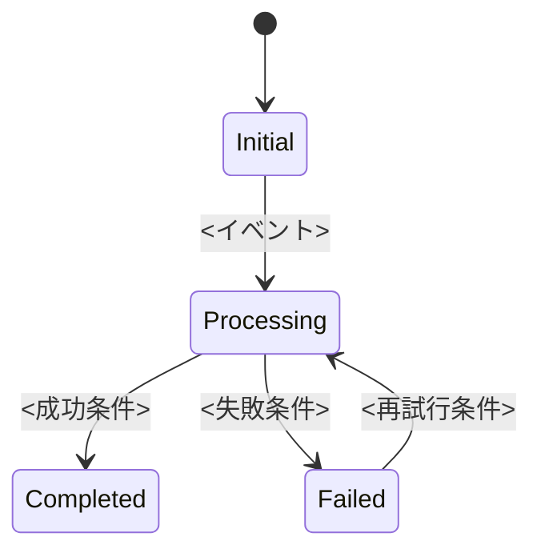
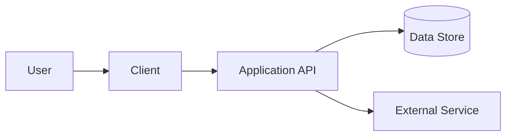

# <必須: プロジェクト名> 開発仕様

> このファイルは、LLMと人間が同じ判断基準でソフトウェアを開発するためのテンプレートです。
> 山括弧で囲まれた記入指示と「記入例」は、仕様確定時に削除または実値へ置き換えてください。

## 0. テンプレートの使い方

### 0.1 記法

| 記法          | 意味                           | 完成版での扱い                 |
| ------------- | ------------------------------ | ------------------------------ |
| `<必須: ...>` | 実装前に確定が必要な項目       | 実値へ置換する                 |
| `<任意: ...>` | 必要な場合に記載する項目       | 実値へ置換するか `N/A` にする  |
| `TBD`         | 未決定。担当者と決定期限が必要 | 原則として実装着手前に解消する |
| `N/A`         | このプロジェクトでは対象外     | 対象外である理由を添える       |
| `MUST`        | 必須。満たさなければ受入不可   | 要件IDとテストを対応させる     |
| `SHOULD`      | 原則必須。例外には理由が必要   | 例外時は設計判断へ記録する     |
| `MAY`         | 任意                           | 実施有無を実装計画で決める     |

### 0.2 良い仕様の条件

- 「適切に」「高速に」「必要に応じて」など、判定不能な表現を単独で使用しない。
- すべての必須動作に、観測可能な入力、結果、失敗時動作を記載する。
- 性能や品質には、測定条件、指標、目標値を記載する。
- 実装方法を固定する必要がない要件は、利用者から見た振る舞いとして記載する。
- 技術選定や互換性など、実装を制約する決定事項は明示する。
- 未決事項をLLMに推測させない。未決事項一覧に記録し、着手可否を示す。
- 例外、空状態、権限不足、外部サービス障害、再試行を正常系と同じ粒度で記載する。
- 要件、実装箇所、テスト、受入基準を要件IDで追跡可能にする。

### 0.3 仕様の優先順位

矛盾がある場合は、原則として次の順序で解釈する。プロジェクト固有の優先順位が異なる場合は、この一覧を更新する。

1. ユーザーから現在の作業に対して明示された最新の指示
2. 本書の安全、セキュリティ、プライバシー要件
3. 本書の受入基準と機能要件
4. 本書のアーキテクチャ、データ、APIなどの技術契約
5. リポジトリ内の開発者向け指示ファイル
6. 既存コード、既存テスト、既存ドキュメント
7. 一般的なフレームワーク慣行

上位と下位の記述が矛盾する場合、LLMは上位を優先する。ただし、データ損失、セキュリティ低下、公開APIの破壊、費用発生、本番操作につながる場合は作業を停止して確認する。

### 0.4 実装を停止して確認する条件

LLMは次の場合、推測で実装を進めず、判明した事実、選択肢、推奨案、影響範囲を提示して確認する。

- 必須項目が未記入で、既存コードからも一意に決定できない。
- MUST要件、受入基準、既存の公開契約が互いに矛盾する。
- 認証、認可、個人情報、決済、外部送信、データ削除の安全な挙動が不明である。
- 破壊的なスキーマ変更、公開API変更、データ移行が必要である。
- 新しい有料サービス、外部依存、ライセンス上の判断が必要である。
- 秘密情報、本番資格情報、実ユーザーデータが必要である。
- デプロイ、本番操作、コミット、PR作成が必要だが明示的に依頼されていない。
- 検証不能な変更になり、代替となる確認方法も定義できない。

---

## 1. 文書情報

| 項目         | 内容                                                     |
| ------------ | -------------------------------------------------------- |
| 文書名       | `<必須: 文書名>`                                         |
| プロジェクト | `<必須: プロジェクト名>`                                 |
| 文書状態     | `<必須: Draft / Review / Approved>`                      |
| バージョン   | `<必須: 例 1.0.0>`                                       |
| 最終更新日   | `<必須: YYYY-MM-DD>`                                     |
| オーナー     | `<必須: 担当者またはチーム>`                             |
| 承認者       | `<任意: 担当者またはチーム>`                             |
| 対象リリース | `<必須: バージョン、マイルストーン、または期間>`         |
| 関連文書     | `<任意: README、ADR、デザイン、Issueなどへの相対リンク>` |

### 1.1 変更履歴

| 日付           | バージョン | 変更内容     | 変更者   | 承認状態  |
| -------------- | ---------- | ------------ | -------- | --------- |
| `<YYYY-MM-DD>` | `<0.1.0>`  | `<初版作成>` | `<名前>` | `<Draft>` |

## 2. エグゼクティブサマリー

### 2.1 背景と課題

<必須: 誰が、どの状況で、何に困っているかを3から5文で記載する。既存システムがある場合は、現在の回避策と限界も記載する。>

### 2.2 目的

<必須: この開発によって実現する利用者価値と事業価値を記載する。機能の羅列ではなく、達成したい結果を書く。>

### 2.3 成功指標

| ID      | 指標             | 現在値           | 目標値         | 測定方法     | 測定時期 |
| ------- | ---------------- | ---------------- | -------------- | ------------ | -------- |
| KPI-001 | `<必須: 指標名>` | `<値または不明>` | `<数値と単位>` | `<計測方法>` | `<時期>` |

### 2.4 成功とみなさないもの

- `<必須: 表面的には動作しても目的達成とみなさない状態>`
- `<例: 正常系のみ動作し、権限エラーでデータが失われる状態>`

## 3. スコープ

### 3.1 対象ユーザーと関係者

| 区分     | 名称     | 目的     | 利用環境・権限 | 特記事項                           |
| -------- | -------- | -------- | -------------- | ---------------------------------- |
| 主利用者 | `<必須>` | `<必須>` | `<必須>`       | `<任意>`                           |
| 運用者   | `<任意>` | `<任意>` | `<任意>`       | `<任意>`                           |
| 関係者   | `<任意>` | `<任意>` | `N/A`          | `<意思決定またはレビュー上の役割>` |

### 3.2 スコープ内

- `<必須: このリリースで提供する機能または変更>`
- `<必須: 対応する利用環境、データ、連携先など>`

### 3.3 スコープ外

- `<必須: 明示的に実装しない機能と理由>`
- `<必須: 将来候補だが今回含めないもの>`

### 3.4 前提条件

- `<必須: 成立を前提とする技術、契約、運用、データの条件>`

### 3.5 制約

| ID      | 分類                                 | 制約     | 理由     | 違反時の影響 |
| ------- | ------------------------------------ | -------- | -------- | ------------ |
| CON-001 | `<技術 / 法務 / 予算 / 期限 / 運用>` | `<必須>` | `<必須>` | `<必須>`     |

### 3.6 依存関係

| ID      | 対象                                 | 種別            | オーナー | 必要時期           | 利用不能時の対応           |
| ------- | ------------------------------------ | --------------- | -------- | ------------------ | -------------------------- |
| DEP-001 | `<サービス、チーム、ライブラリなど>` | `<内部 / 外部>` | `<担当>` | `<日付または工程>` | `<fallbackまたはブロック>` |

## 4. 用語とドメインルール

### 4.1 用語

| 用語     | 定義                     | 使用しない類義語 | 備考     |
| -------- | ------------------------ | ---------------- | -------- |
| `<必須>` | `<一意に解釈できる定義>` | `<任意>`         | `<任意>` |

### 4.2 ドメインルール

| ID     | ルール                             | 入力・条件 | 結果     | 例外               |
| ------ | ---------------------------------- | ---------- | -------- | ------------------ |
| BR-001 | `<必須: 業務上常に成立すべき規則>` | `<条件>`   | `<結果>` | `<例外またはなし>` |

### 4.3 計算・判定式

<任意: 丸め、タイムゾーン、通貨、単位、上限・下限を含めて数式または擬似コードで定義する。>

```text
<例: result = round_half_up(base_amount * rate, 2)>
```

## 5. 現状と目標状態

### 5.1 現在の状態

<必須: 新規開発なら「新規」と記載する。既存開発なら、関連する画面、API、データ、既知の問題、現在のテスト状態を記載する。>

| 領域     | 現在の実装 | 根拠となるファイル・URL | 既知の問題         |
| -------- | ---------- | ----------------------- | ------------------ |
| `<領域>` | `<状態>`   | `<相対パスまたはURL>`   | `<問題またはなし>` |

### 5.2 目標状態

<必須: リリース完了後に、利用者とシステムから観測できる状態を記載する。>

### 5.3 差分

| ID      | 現状     | 目標     | 必要な変更   | 対応要件   |
| ------- | -------- | -------- | ------------ | ---------- |
| GAP-001 | `<現状>` | `<目標>` | `<変更概要>` | `<FR-...>` |

## 6. ユーザー体験

### 6.1 主要ユースケース

| ID     | アクター | 目的     | 開始条件 | 正常終了               | 対応要件   |
| ------ | -------- | -------- | -------- | ---------------------- | ---------- |
| UC-001 | `<必須>` | `<必須>` | `<必須>` | `<観測可能な終了状態>` | `<FR-...>` |

### 6.2 基本フロー

1. `<利用者またはシステムの操作>`
2. `<システムの応答>`
3. `<完了状態>`

### 6.3 代替フローと異常フロー

| ID     | 発生条件 | システム動作 | ユーザーへの表示 | 復旧方法               |
| ------ | -------- | ------------ | ---------------- | ---------------------- |
| AF-001 | `<必須>` | `<必須>`     | `<必須>`         | `<自動 / 手動 / 不可>` |

### 6.4 画面・操作仕様

画面ごとにこの節を複製する。UIを持たないプロジェクトでは `N/A` とする。

#### UI-001 `<画面またはコンポーネント名>`

| 項目             | 仕様                                   |
| ---------------- | -------------------------------------- |
| 目的             | `<必須>`                               |
| 表示条件         | `<必須>`                               |
| 主要要素         | `<ラベル、情報、操作>`                 |
| 入力規則         | `<形式、長さ、必須、正規化>`           |
| 操作結果         | `<成功、処理中、無効状態>`             |
| エラー表示       | `<表示場所、文言方針、再試行>`         |
| 空状態           | `<データ0件時の表示と操作>`            |
| レスポンシブ     | `<対象viewportと変化>`                 |
| アクセシビリティ | `<キーボード、focus、名称、通知>`      |
| デザイン参照     | `<相対リンク、画像、デザインシステム>` |

### 6.5 状態遷移



| 現在状態 | イベント     | ガード条件         | 次状態   | 副作用                   |
| -------- | ------------ | ------------------ | -------- | ------------------------ |
| `<状態>` | `<イベント>` | `<条件またはなし>` | `<状態>` | `<データ変更、通知など>` |

## 7. 機能要件

要件IDは変更しない。削除した要件のIDを別要件へ再利用しない。各MUST要件には、少なくとも1件の受入基準と検証方法を対応させる。

### 7.1 要件一覧

| ID     | 優先度 | 要件                                             | 根拠                     | 受入基準   | 備考         |
| ------ | ------ | ------------------------------------------------ | ------------------------ | ---------- | ------------ |
| FR-001 | MUST   | `<システムは、条件のとき、観測可能な動作を行う>` | `<利用者価値または制約>` | `<AC-001>` | `<任意>`     |
| FR-002 | SHOULD | `<要件>`                                         | `<根拠>`                 | `<AC-...>` | `<例外条件>` |

### 7.2 詳細要件

複雑な要件ごとにこの節を複製する。単純な要件は一覧のみでもよい。

#### FR-001 `<要件名>`

- **入力:** `<データ、イベント、操作>`
- **事前条件:** `<権限、状態、依存サービス>`
- **処理:** `<外部から観測できる処理規則>`
- **出力:** `<結果、イベント、状態変更>`
- **事後条件:** `<必ず成立する状態>`
- **失敗時:** `<エラー、ロールバック、再試行>`
- **境界値:** `<0件、最大値、重複、期限など>`
- **監査:** `<記録する情報と記録しない情報>`

## 8. データ仕様

### 8.1 データモデル

| エンティティ | 目的     | 識別子   | 保管先   | 保持期間             | 個人・機密情報 |
| ------------ | -------- | -------- | -------- | -------------------- | -------------- |
| `<必須>`     | `<必須>` | `<必須>` | `<必須>` | `<期間または無期限>` | `<有無と分類>` |

### 8.2 フィールド定義

#### `<EntityName>`

| フィールド | 型                    | 必須 | 制約・既定値       | 例     | 説明     |
| ---------- | --------------------- | ---- | ------------------ | ------ | -------- |
| `id`       | `<string / UUIDなど>` | Yes  | `<一意、変更不可>` | `<例>` | `<説明>` |

### 8.3 データライフサイクル

- **作成:** `<作成契機、作成者、初期値>`
- **更新:** `<更新可能者、競合制御、監査>`
- **削除:** `<論理 / 物理、関連データ、期限>`
- **エクスポート:** `<形式、権限、対象範囲、またはN/A>`
- **バックアップ・復元:** `<目標、手順、またはN/A>`

### 8.4 整合性と移行

| 項目         | 仕様                                  |
| ------------ | ------------------------------------- |
| 一意性       | `<キーと範囲>`                        |
| 参照整合性   | `<削除・更新時の扱い>`                |
| 同時更新     | `<楽観 / 悲観 / last-write-winsなど>` |
| 冪等性       | `<キーと有効期間>`                    |
| スキーマ移行 | `<前方・後方互換、展開順序>`          |
| ロールバック | `<旧版へ戻す際のデータ互換性>`        |

## 9. API・イベント契約

### 9.1 共通規約

| 項目           | 仕様                                   |
| -------------- | -------------------------------------- |
| プロトコル     | `<HTTP / RPC / WebSocket / queueなど>` |
| データ形式     | `<JSON、文字コード、日時形式など>`     |
| 認証           | `<方式>`                               |
| 認可           | `<所有者、role、scopeなど>`            |
| バージョニング | `<方式>`                               |
| タイムアウト   | `<接続、応答、処理>`                   |
| 再試行         | `<対象、回数、backoff、非対象>`        |
| レート制限     | `<単位、上限、超過時応答>`             |
| 相関ID         | `<ヘッダーまたはフィールド>`           |

### 9.2 エンドポイント

エンドポイントごとにこの節を複製する。

#### API-001 `<METHOD /path>`

| 項目             | 仕様                                 |
| ---------------- | ------------------------------------ |
| 目的             | `<必須>`                             |
| 対応要件         | `<FR-...>`                           |
| 認証・権限       | `<必須>`                             |
| Path / Query     | `<名前、型、必須、制約>`             |
| Request body     | `<型またはschemaへのリンク>`         |
| Success response | `<status、型、header>`               |
| Error response   | `<コード、条件、再試行可否>`         |
| 副作用           | `<データ変更、外部呼出し、イベント>` |
| 冪等性           | `<キー、重複時結果、またはN/A>`      |

```json
{
  "example": "<仕様と誤認されない、実際の契約に適合する例>"
}
```

### 9.3 イベント

| ID      | イベント名 | 発行条件 | Producer   | Consumer   | 配信保証             | Schema               |
| ------- | ---------- | -------- | ---------- | ---------- | -------------------- | -------------------- |
| EVT-001 | `<名前>`   | `<条件>` | `<発行元>` | `<購読先>` | `<at-most-onceなど>` | `<定義またはリンク>` |

### 9.4 エラーコード

| コード         | HTTP等の状態 | 発生条件       | 利用者向け動作         | 再試行         | ログレベル |
| -------------- | ------------ | -------------- | ---------------------- | -------------- | ---------- |
| `<ERROR_CODE>` | `<状態>`     | `<一意な条件>` | `<表示またはfallback>` | `<可否と条件>` | `<level>`  |

## 10. 外部連携

| ID      | 連携先       | 用途     | 送信データ       | 受信データ | 認証     | SLA・制限          | 障害時動作   |
| ------- | ------------ | -------- | ---------------- | ---------- | -------- | ------------------ | ------------ |
| EXT-001 | `<サービス>` | `<用途>` | `<最小限の項目>` | `<項目>`   | `<方式>` | `<timeout、quota>` | `<fallback>` |

### 10.1 環境変数と設定

秘密値そのものを本書へ記載しない。値の形式、取得元、必須性、秘密区分だけを記載する。

| 変数・設定      | 必須         | 秘密         | 用途     | 形式・既定値 | 未設定時の動作      |
| --------------- | ------------ | ------------ | -------- | ------------ | ------------------- |
| `<CONFIG_NAME>` | `<Yes / No>` | `<Yes / No>` | `<用途>` | `<形式>`     | `<失敗 / fallback>` |

### 10.2 対応環境

| 環境       | 用途     | 外部連携                    | データ種別        | 制約     |
| ---------- | -------- | --------------------------- | ----------------- | -------- |
| Local      | `<用途>` | `<mock / sandbox / actual>` | `<syntheticなど>` | `<制約>` |
| Test       | `<用途>` | `<連携>`                    | `<データ>`        | `<制約>` |
| Production | `<用途>` | `<連携>`                    | `<データ>`        | `<制約>` |

## 11. セキュリティとプライバシー

### 11.1 脅威と対策

| ID      | 資産・境界 | 脅威     | 対策                 | 検証方法            | 残存リスク |
| ------- | ---------- | -------- | -------------------- | ------------------- | ---------- |
| SEC-001 | `<対象>`   | `<脅威>` | `<予防・検知・復旧>` | `<テスト / review>` | `<リスク>` |

### 11.2 必須方針

- 認証と認可を別々に定義し、すべての保護対象でサーバー側検証を行う。
- 入力を信頼せず、型、長さ、形式、許容値、権限を境界で検証する。
- 秘密情報をソースコード、仕様、ログ、エラー、クライアントへ含めない。
- ログへ保存するデータとマスキング対象を明示する。
- 外部URLやファイルを扱う場合、SSRF、path traversal、content type、sizeを検証する。
- 削除、外部送信、課金など不可逆または高影響の操作には確認と監査を設ける。

### 11.3 データ分類

| データ     | 分類                          | 収集目的 | 法的根拠・同意 | 保存場所 | 保持・削除 | モデル・外部送信 |
| ---------- | ----------------------------- | -------- | -------------- | -------- | ---------- | ---------------- |
| `<データ>` | `<公開 / 内部 / 機密 / 個人>` | `<目的>` | `<根拠>`       | `<場所>` | `<期間>`   | `<有無と範囲>`   |

## 12. 非機能要件

各目標には測定条件を記載する。「高速」「大量」など数値のない表現は使用しない。

| ID      | 分類             | 指標・目標                       | 測定条件                   | 検証方法           |
| ------- | ---------------- | -------------------------------- | -------------------------- | ------------------ |
| NFR-001 | 性能             | `<例: p95 500 ms以下>`           | `<データ量、同時数、環境>` | `<command / tool>` |
| NFR-002 | 可用性           | `<目標と測定期間>`               | `<除外条件>`               | `<監視方法>`       |
| NFR-003 | スケーラビリティ | `<上限と増加方法>`               | `<負荷条件>`               | `<負荷試験>`       |
| NFR-004 | アクセシビリティ | `<WCAG水準または具体条件>`       | `<対象画面>`               | `<自動 + 手動>`    |
| NFR-005 | 対応環境         | `<OS、browser、runtimeなど>`     | `<version方針>`            | `<matrix>`         |
| NFR-006 | 観測性           | `<ログ、metric、trace、alert>`   | `<識別子と保持期間>`       | `<障害シナリオ>`   |
| NFR-007 | 保守性           | `<複雑度、coverage、文書化など>` | `<対象範囲>`               | `<lint / test>`    |

## 13. アーキテクチャと設計制約

### 13.1 システム構成



### 13.2 コンポーネント責務

| コンポーネント | 責務     | 所有データ           | 公開境界        | 禁止事項           |
| -------------- | -------- | -------------------- | --------------- | ------------------ |
| `<必須>`       | `<必須>` | `<データまたはなし>` | `<API / event>` | `<他層の責務など>` |

### 13.3 技術選定

| 領域            | 採用技術・バージョン | 状態               | 選定理由 | 代替案・制約 |
| --------------- | -------------------- | ------------------ | -------- | ------------ |
| `<runtimeなど>` | `<技術>`             | `<決定済み / TBD>` | `<理由>` | `<制約>`     |

### 13.4 設計原則

- `<必須: 既存パターン、レイヤー境界、依存方向など>`
- `<例: 外部サービス固有の型をドメイン層へ漏らさない>`

### 13.5 変更禁止・保護対象

| 対象                                       | 制約                   | 変更が必要な場合の手順 |
| ------------------------------------------ | ---------------------- | ---------------------- |
| `<公開API、生成物、vendor、migrationなど>` | `<変更禁止または条件>` | `<確認先、互換策>`     |

## 14. エラー処理と復旧

| 障害              | 検知         | 自動再試行           | 利用者への通知 | 状態・データ復旧      | 運用対応            |
| ----------------- | ------------ | -------------------- | -------------- | --------------------- | ------------------- |
| `<依存先timeout>` | `<検知条件>` | `<回数、間隔、上限>` | `<表示>`       | `<rollback / resume>` | `<alert / runbook>` |

### 14.1 共通原則

- 同じ要求の再送で副作用が重複しないよう、必要な操作に冪等性を設ける。
- 再試行可能な失敗と再試行してはならない失敗を区別する。
- 部分成功時に残る状態と補償処理を定義する。
- 利用者向けメッセージに秘密情報や内部stack traceを含めない。
- 復旧不能時も、失われた可能性のあるデータと次の操作を明示する。

## 15. 互換性・移行・リリース

### 15.1 互換性

| 対象                           | 現行     | 変更後   | 互換性            | 対応                     |
| ------------------------------ | -------- | -------- | ----------------- | ------------------------ |
| `<API / schema / config / UI>` | `<現行>` | `<変更>` | `<互換 / 非互換>` | `<versioning / adapter>` |

### 15.2 移行計画

1. `<事前検証またはbackfill>`
2. `<後方互換なコード展開>`
3. `<データ移行>`
4. `<旧経路停止>`
5. `<完了確認>`

### 15.3 ロールバック条件

| 条件               | 判定方法   | ロールバック操作 | データへの影響 |
| ------------------ | ---------- | ---------------- | -------------- |
| `<error rateなど>` | `<metric>` | `<操作>`         | `<影響と復旧>` |

> LLMの既定作業範囲はローカル実装とローカル検証までとする。コミット、PR作成、パッケージ公開、インフラ変更、デプロイ、本番確認は、ユーザーが明示的に依頼した場合だけ実施する。

## 16. テスト戦略

### 16.1 テストレベル

| レベル      | 対象                             | 必須観点                 | 実行環境              | 合格条件          |
| ----------- | -------------------------------- | ------------------------ | --------------------- | ----------------- |
| Unit        | `<純粋ロジック、validationなど>` | `<正常、境界、異常>`     | `<local>`             | `<全件成功>`      |
| Integration | `<DB、API、外部adapterなど>`     | `<契約、認可、障害>`     | `<test envなど>`      | `<全件成功>`      |
| E2E         | `<主要フロー>`                   | `<利用者視点>`           | `<browser / sandbox>` | `<全件成功>`      |
| Manual      | `<自動化困難な項目>`             | `<見た目、支援技術など>` | `<対象環境>`          | `<checklist完了>` |

### 16.2 テストケース

| ID     | 対応要件   | レベル       | 前提     | 操作・入力 | 期待結果           | 自動化       |
| ------ | ---------- | ------------ | -------- | ---------- | ------------------ | ------------ |
| TC-001 | `<FR-001>` | `<Unitなど>` | `<前提>` | `<入力>`   | `<観測可能な結果>` | `<Yes / No>` |

### 16.3 検証コマンド

実在し、リポジトリルートから実行できるコマンドだけを記載する。対象のコマンドがない場合は `N/A` と理由を記載する。

| 順序 | 目的       | コマンド                              | 期待結果             | 必須         |
| ---- | ---------- | ------------------------------------- | -------------------- | ------------ |
| 1    | 対象テスト | `<必須: 例 npm test -- path/to/test>` | `<exit 0、件数など>` | Yes          |
| 2    | 全テスト   | `<必須またはN/A>`                     | `<exit 0>`           | `<Yes / No>` |
| 3    | Lint       | `<必須またはN/A>`                     | `<error 0>`          | `<Yes / No>` |
| 4    | 型検査     | `<必須またはN/A>`                     | `<error 0>`          | `<Yes / No>` |
| 5    | Build      | `<必須またはN/A>`                     | `<成功>`             | `<Yes / No>` |
| 6    | その他     | `<性能、security、a11yなど>`          | `<閾値内>`           | `<Yes / No>` |

### 16.4 テストデータ

- `<fixture、factory、seedの場所と作成方法>`
- `<実ユーザーデータや本番秘密情報を使用しないこと>`
- `<時刻、乱数、外部サービスを再現可能にする方法>`

### 16.5 検証不能時の扱い

検証を実行できない場合、LLMは成功したとみなしてはならない。最終報告に次を記載する。

- 実行できなかったコマンドまたは確認項目
- 理由と得られたエラー
- 変更の正しさを確認するために実施した代替検証
- 残存リスクと、利用者が実行すべき具体的な手順

## 17. 受入基準

受入基準は実装方法ではなく、利用者または外部境界から観測できる結果として記載する。

### AC-001 `<シナリオ名>`

**Given** `<初期状態と権限>`  
**And** `<追加の前提条件>`  
**When** `<利用者または外部システムの操作>`  
**Then** `<観測可能な結果>`  
**And** `<状態、データ、通知、副作用>`

### AC-002 `<異常系シナリオ名>`

**Given** `<初期状態>`  
**When** `<障害または不正な入力>`  
**Then** `<安全な失敗結果>`  
**And** `<データが失われない、外部送信されない等の保証>`

## 18. 要件トレーサビリティ

実装前に行を作成し、実装中に対象と状態を更新する。MUST要件に空欄がある場合は完了としない。

| 要件ID | 設計・ルール                | 実装ファイル・シンボル | テストID・ファイル | 受入基準   | 状態                           |
| ------ | --------------------------- | ---------------------- | ------------------ | ---------- | ------------------------------ |
| FR-001 | `<BR / API / UI / ADRなど>` | `<path: symbol>`       | `<TC-001: path>`   | `<AC-001>` | `<未着手 / 実装中 / 検証済み>` |

## 19. 実装計画

### 19.1 変更対象

| 順序 | 対象ファイル・シンボル | 変更内容           | 対応要件   | 依存                | 検証             |
| ---- | ---------------------- | ------------------ | ---------- | ------------------- | ---------------- |
| 1    | `<path: symbol>`       | `<最小の変更単位>` | `<FR-...>` | `<なし / 手順番号>` | `<TC / command>` |

### 19.2 変更しないもの

- `<今回の要求に近いが変更対象外とする領域と理由>`
- `<互換性のため保持する公開契約>`

### 19.3 リスク

| ID       | リスク     | 可能性           | 影響             | 軽減策   | 検知方法          |
| -------- | ---------- | ---------------- | ---------------- | -------- | ----------------- |
| RISK-001 | `<リスク>` | `<低 / 中 / 高>` | `<低 / 中 / 高>` | `<対策>` | `<test / metric>` |

### 19.4 並列化と順序制約

- **先に行う:** `<schemaや契約など、後続の前提>`
- **並列に行える:** `<独立した作業>`
- **最後に行う:** `<統合、文書、全体検証>`

## 20. LLM開発実行契約

この章は、LLMへ「このSPECに従って開発してください」と依頼した場合の既定動作を定義する。プロジェクト固有の指示が必要な場合は追記する。

### 20.1 着手前

LLMは実装前に次を行う。

1. 本書を読み、対象要件、受入基準、変更境界、検証コマンドを特定する。
2. リポジトリの開発者向け指示、README、package manifest、対象コード、近接テストを確認する。
3. 既存実装と本書の「現状」が一致するか確認し、不一致を報告する。
4. 要件を満たす最小の変更箇所と、最初に実行する焦点を絞った検証を決める。
5. 不明点が実装結果を左右する場合は、0.4の条件に従って質問する。

### 20.2 実装中

- 既存のアーキテクチャ、命名、型、エラー処理、テストパターンを優先する。
- 要件に不要なリファクタリング、整形、依存更新を行わない。
- 根本原因を修正し、症状を隠すだけの分岐や例外握り潰しを追加しない。
- 公開APIを変更する場合は、仕様に記載された互換性方針を守る。
- 新規依存は、標準機能や既存依存で妥当に解決できない場合に限る。
- 秘密情報、実データ、資格情報をコード、テスト、ログ、仕様へ追加しない。
- 生成ファイルやlockfileは、必要な場合だけ正規のコマンドで更新する。
- 最初の実質的変更後、追加変更を広げる前に、対象を絞ったテストまたは型検査を実行する。
- 検証失敗時は同じ変更範囲で原因を修正し、同じ検証を再実行する。
- ユーザーによる未コミット変更を保持し、無関係な差分を戻さない。

### 20.3 LLMが推測してよい事項

- 既存コードに一貫したパターンがあり、公開契約や利用者動作を変えない内部実装。
- 既存テストから一意に決まるテスト配置、命名、fixture形式。
- formatterやlint設定から一意に決まるコードスタイル。

### 20.4 LLMが推測してはならない事項

- 未記載の業務ルール、権限、料金、法的要件、データ保持期間。
- 個人情報や機密情報を収集・送信・保存してよいかどうか。
- 破壊的変更を許容してよいかどうか。
- 本番環境、クラウド資源、外部アカウントを操作してよいかどうか。
- テスト失敗を既知問題として無視してよいかどうか。
- `TBD` のうち実装結果や安全性を左右する値。

### 20.5 完了時

LLMは次の条件をすべて満たした場合だけ作業完了とする。

- 対象MUST要件が実装されている。
- 対応する受入基準を満たすテストまたは具体的な確認結果がある。
- 必須の検証コマンドが成功している。
- 新たなlint、型、build、testエラーを追加していない。
- 要件トレーサビリティと関連文書が実装と一致している。
- 変更範囲に秘密情報、不要な生成物、無関係な差分がない。
- 未実施項目と残存リスクが最終報告に明記されている。

## 21. Definition of Done

- [ ] すべての必須プレースホルダーが実値または理由付き `N/A` になっている。
- [ ] ブロッカーに分類された `TBD` が残っていない。
- [ ] スコープ内のMUST要件を実装した。
- [ ] 正常系、境界値、主要な異常系をテストした。
- [ ] 認証、認可、入力検証、秘密情報の扱いを確認した。
- [ ] 必須のlint、型検査、テスト、buildが成功した。
- [ ] 要件から実装、テスト、受入基準まで追跡できる。
- [ ] API、設定、運用方法に変更がある場合、関連文書を更新した。
- [ ] 後方互換性または移行手順を確認した。
- [ ] 未実施の検証と残存リスクを報告した。
- [ ] コミット、PR、デプロイは依頼された場合にだけ実施した。

## 22. 未決事項

`TBD` は必ずこの表にも登録する。「ブロッカー」がYesの項目を未解決のまま実装しない。

| ID      | 質問・決定事項 | 選択肢    | 推奨案           | 決定者   | 期限           | ブロッカー   | 状態・決定          |
| ------- | -------------- | --------- | ---------------- | -------- | -------------- | ------------ | ------------------- |
| TBD-001 | `<未決事項>`   | `<A / B>` | `<理由付き推奨>` | `<担当>` | `<YYYY-MM-DD>` | `<Yes / No>` | `<Open / 決定内容>` |

## 23. 最終報告フォーマット

LLMは実装終了時、ユーザーへ次の形式で簡潔に報告する。

```markdown
## 変更概要

<利用者から見た変更と、主要な実装内容>

## 要件別結果

| 要件   | 結果 | 主な実装箇所         |
| ------ | ---- | -------------------- |
| FR-001 | 完了 | path/to/file: symbol |

## 検証

- `<command>`: 成功（<テスト件数や重要な結果>）
- `<手動確認>`: 成功（<確認内容>）

## 未実施・残課題

- <なし、または理由・リスク・次の手順>
```

## 付録A. 仕様完成チェック

### 内容

- [ ] 目的と成功指標が、機能名ではなく成果として定義されている。
- [ ] スコープ内とスコープ外が明確である。
- [ ] 対象ユーザー、主要フロー、異常フローが定義されている。
- [ ] MUST要件に一意なIDと受入基準がある。
- [ ] データ型、API入出力、エラー、権限が具体的である。
- [ ] 性能などの非機能要件に数値と測定条件がある。
- [ ] セキュリティ、プライバシー、データ削除が定義されている。
- [ ] 既存実装からの差分と変更禁止範囲が定義されている。

### LLM実行可能性

- [ ] 着手前に読むファイルと変更対象が特定できる。
- [ ] LLMが推測してよい事項と質問すべき事項が区別されている。
- [ ] 最初に実行する焦点を絞った検証を決められる。
- [ ] 実在する検証コマンドと期待結果が記載されている。
- [ ] 要件、実装、テスト、受入基準を追跡できる。
- [ ] 完了条件と最終報告形式が明確である。

## 付録B. 要件IDの推奨体系

| Prefix  | 用途                 |
| ------- | -------------------- |
| `KPI-`  | 成功指標             |
| `CON-`  | 制約                 |
| `DEP-`  | 依存関係             |
| `BR-`   | ドメイン・業務ルール |
| `GAP-`  | 現状と目標の差分     |
| `UC-`   | ユースケース         |
| `UI-`   | 画面・コンポーネント |
| `FR-`   | 機能要件             |
| `API-`  | API契約              |
| `EVT-`  | イベント契約         |
| `EXT-`  | 外部連携             |
| `SEC-`  | セキュリティ要件     |
| `NFR-`  | 非機能要件           |
| `AF-`   | 代替・異常フロー     |
| `RISK-` | リスク               |
| `TC-`   | テストケース         |
| `AC-`   | 受入基準             |
| `TBD-`  | 未決事項             |

<!-- End of template -->
